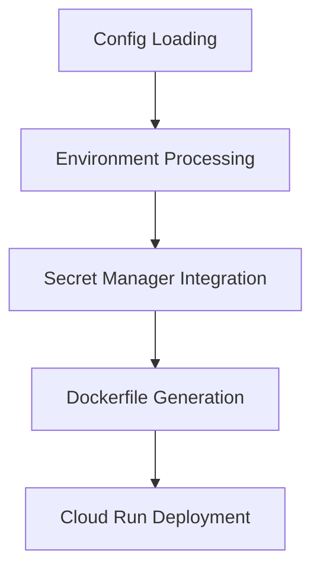
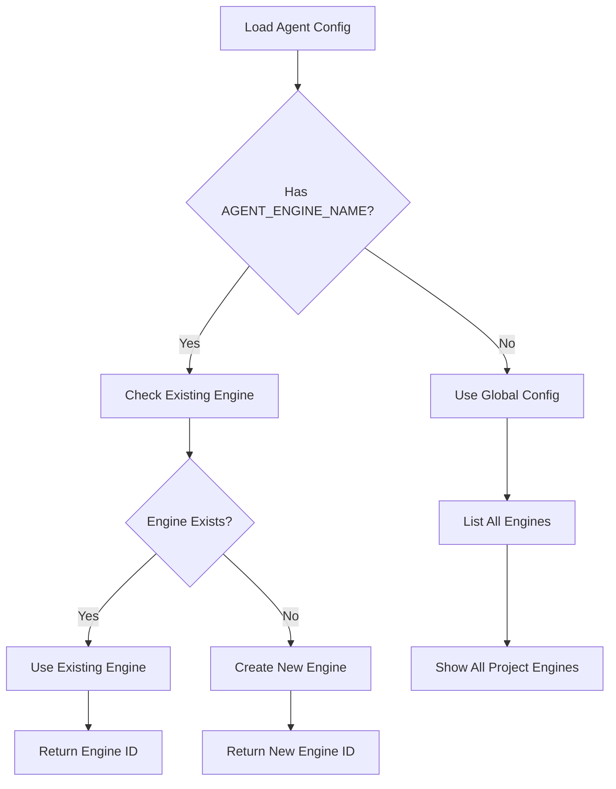
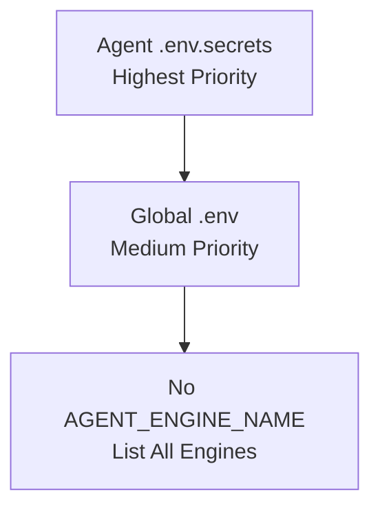
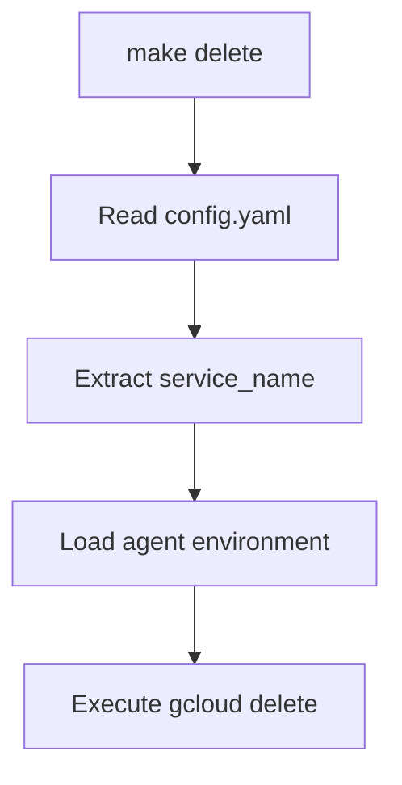
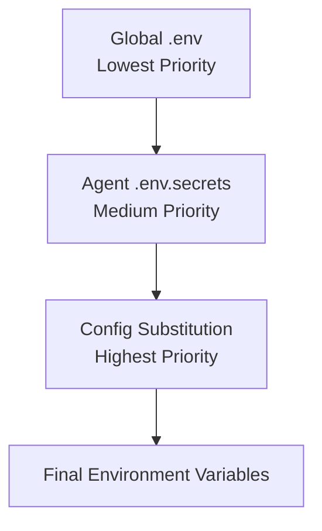

# Utils Folder - ADK Agents Deployment Utilities

This folder contains utility scripts that support the ADK Agents deployment system.

## 📁 Overview

```
utils/
├── README.md                    # This documentation
├── deploy_agent.py             # Main deployment engine
├── create_agent_engine.py      # Vertex AI Agent Engine creator
├── makefile_helper.py          # Makefile utility for delete operations
├── env_manager.py              # Environment management module
├── docker_builder.py           # Docker and build operations
├── cloud_deployer.py           # Cloud Run deployment module
└── testing_utils.py            # Testing utilities
```

**Note**: For general usage and configuration, see the main project README.

## 🚀 deploy_agent.py

The main deployment script that handles:
- Dynamic agent configuration loading
- Environment variable processing with 3-tier priority
- Secret Manager integration for secure deployments
- Dockerfile generation from templates
- Google Cloud Run deployment with proper flag handling

### Core Capabilities

1. **Configuration Processing**: Loads and validates per-agent `config.yaml` files
2. **Environment Management**: 3-tier priority system (global `.env` → agent `.env.secrets` → substitution)
3. **Secret Manager Integration**: Properly handles `--update-secrets` flags and excludes secrets from `--set-env-vars`
4. **Docker Build System**: Creates isolated build environments with generated Dockerfiles
5. **Cloud Run Deployment**: Executes `gcloud run deploy` with all required flags and configurations

### Deployment Process



### Key Features

- **Isolated Build Environments**: Each deployment uses a temporary build directory
- **Template-based Dockerfiles**: Dynamic Dockerfile generation with agent-specific customizations
- **Comprehensive Validation**: Multi-layer configuration validation with detailed error messages
- **Dry Run Support**: Simulate deployments without executing
- **Debug Logging**: Verbose output for troubleshooting

## 🤖 create_agent_engine.py

Vertex AI Agent Engine management module with per-agent configuration support.

### Agent Engine Management Features

1. **Per-Agent Configuration**: Uses agent-specific `.env.secrets` files
2. **Duplicate Prevention**: Prevents creating engines with duplicate display names
3. **Engine Listing**: Lists all agent engines or filter by specific agent
4. **Engine Deletion**: Safely delete agent engines with confirmation
5. **Environment Priority**: Falls back from agent-specific to global configuration

### Agent Engine Workflow



### Usage Examples

```bash
# Create agent engine for specific agent (uses agents/{agent}/.env.secrets)
make create-agent-engine <agent_name>

# List agent engines for specific agent
make list-agent-engines <agent_name>

# List all agent engines (project-wide view)
python utils/create_agent_engine.py --list

# Delete agent engine for specific agent
make delete-agent-engine <agent_name>

# Direct usage with agent name
python utils/create_agent_engine.py <agent_name>
python utils/create_agent_engine.py <agent_name> --list
python utils/create_agent_engine.py <agent_name> --delete
```

### Environment Variable Priority



## 🗑️ makefile_helper.py

Utility script for makefile operations with intelligent service management.

### Key Features

1. **Auto-Detection**: Automatically reads service names from agent `config.yaml` files
2. **Environment Loading**: Uses agent-specific environment variables via `env_manager.py`
3. **Error Handling**: Comprehensive validation and helpful error messages
4. **Clean Integration**: Simple interface for makefile commands

### Usage

```bash
# Delete Cloud Run service with auto-detected service name
make delete customer_service  # Deletes "customer-service-agent" from config.yaml
```

### Workflow



## 🔗 Integration with Makefile

The utils scripts integrate with the project makefile:

```makefile
make deploy agent           →   python utils/deploy_agent.py --deploy agent
make deploy-dry agent       →   python utils/deploy_agent.py --deploy agent --dry-run
make test-build agent       →   python utils/deploy_agent.py test build agent
make test-dockerfile agent  →   python utils/deploy_agent.py test dockerfile agent
make create-agent-engine    →   python utils/create_agent_engine.py agent
make delete agent           →   python utils/makefile_helper.py delete agent
```

## 🧪 Testing Features

Both scripts include testing capabilities:

### deploy_agent.py Testing
- **Build Structure Testing**: Validates file copying and build setup
- **Dockerfile Generation Testing**: Tests Dockerfile creation without deployment
- **Dry Run Mode**: Simulates complete deployment process

### create_agent_engine.py Testing
- **Environment Validation**: Checks required Google Cloud configuration
- **Permission Verification**: Validates Vertex AI API access

## 📊 Environment Variables

### Variable Priority System



### Required for All Operations
- `GOOGLE_CLOUD_PROJECT`: Google Cloud project ID
- `GOOGLE_CLOUD_LOCATION`: Google Cloud region

### Required for Agent Engine Creation
- `AGENT_ENGINE_NAME`: Display name for the Agent Engine

### Agent-Specific (from `.env.secrets`)
- `SERVICE_ACCOUNT`: Service account for Cloud Run deployment
- `SECRET_NAME`: Secret Manager secret name
- Other agent-specific configuration variables

---

**Purpose**: This documentation provides a high-level overview of the utils scripts. For detailed usage examples and configuration guides, refer to the main project README.